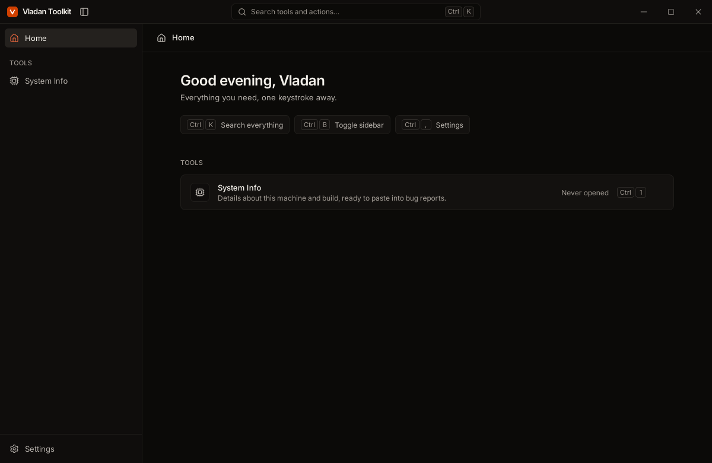

<div align="center">


# Vladan Toolkit

**One app, every tool I need.** A fast, keyboard-first desktop toolkit for macOS, Windows
and Linux, built to grow one tool at a time.

[](https://github.com/vladanp/vladan-toolkit-app/actions/workflows/ci.yml)
[](https://github.com/vladanp/vladan-toolkit-app/actions/workflows/security.yml)
[](https://github.com/vladanp/vladan-toolkit-app/actions/workflows/codeql.yml)
[](https://scorecard.dev/viewer/?uri=github.com/vladanp/vladan-toolkit-app)
[](https://github.com/vladanp/vladan-toolkit-app/releases/latest)
[](LICENSE)



</div>

## Download

Grab the installer for your system from the
[latest release](https://github.com/vladanp/vladan-toolkit-app/releases/latest):

| System | File | Notes |
| --- | --- | --- |
| Windows 10/11 | `Vladan.Toolkit_x.y.z_x64-setup.exe` | Installs for your user only, no admin rights needed. The `.msi` is for machine-wide installs. |
| macOS 13+ | `Vladan.Toolkit_x.y.z_universal.dmg` | Apple Silicon and Intel. |
| Linux | `.AppImage`, `.deb` or `.rpm` | The AppImage runs on any distribution; `.deb` and `.rpm` integrate with your package manager. |

The installers are not code signed yet, so the first launch shows a warning once.
On Windows, click **More info → Run anyway**. On macOS, right-click the app and choose
**Open**. After that, the app checks for updates and installs them itself.

## Using it

| | |
| --- | --- |
| <kbd>⌘K</kbd> / <kbd>Ctrl K</kbd> | Search every tool and action |
| <kbd>⌘1</kbd>…<kbd>⌘9</kbd> | Jump straight to a tool |
| <kbd>⌘B</kbd> | Collapse the sidebar |
| <kbd>⌘,</kbd> | Settings: theme, accent color, updates |

## Built with

[Tauri 2](https://v2.tauri.app) (Rust + the system webview, ~10 MB installers) ·
React 19 + React Compiler · TypeScript 7 · Vite 8 · Tailwind CSS 4 · Base UI ·
TanStack Router · typed Rust↔TypeScript IPC via tauri-specta.

## Development

```sh
pnpm install          # dependencies + git hooks
pnpm dev              # run the app with hot reload
pnpm new:tool my-tool # scaffold a new tool (add --rust for native code)
pnpm check            # lint, typecheck, tests (JS + Rust)
```

Prerequisites: Node 26, pnpm 12, Rust stable and the
[Tauri system dependencies](https://v2.tauri.app/start/prerequisites/).

- **Architecture, conventions, adding tools:** [CLAUDE.md](CLAUDE.md)
- **Contributing:** [CONTRIBUTING.md](CONTRIBUTING.md)
- **One-time GitHub setup** (branch protection, update signing key): [docs/SETUP.md](docs/SETUP.md)

## Quality & security

Every change runs ~190 unit/component tests (real Chromium), Playwright end-to-end tests
with WCAG 2.2 AA accessibility scans in two browser engines, Rust tests on three operating
systems, and WebDriver tests against the compiled app on macOS, Windows and Linux.
Coverage is enforced. Dependencies, workflows and code are scanned continuously, and every
installer ships with signed build provenance. Details in [SECURITY.md](SECURITY.md).

Releases are automatic: [Conventional Commits](https://www.conventionalcommits.org/) decide
the next version, release-please keeps a release PR with the changelog, and merging it
builds and publishes installers for all platforms.
